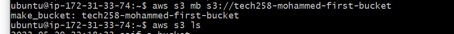

# AWS S3

- [AWS S3](#aws-s3)
    - [What is AWS S3?](#what-is-aws-s3)
    - [How to access AWS S3](#how-to-access-aws-s3)
    - [CRUD = Create, read, update and delete](#crud--create-read-update-and-delete)
      - [Receive help on AWS S3:](#receive-help-on-aws-s3)
      - [How to make a bucket:](#how-to-make-a-bucket)
      - [How to list a bucket:](#how-to-list-a-bucket)
      - [How to create a file and write inside using CLI:](#how-to-create-a-file-and-write-inside-using-cli)
      - [How to synchronise specified bucket with the current directory:](#how-to-synchronise-specified-bucket-with-the-current-directory)
      - [How to copy the file to the bucket:](#how-to-copy-the-file-to-the-bucket)
      - [How to make a directory called "downloads":](#how-to-make-a-directory-called-downloads)
      - [How to list contents of the bucket have been correctly downloaded:](#how-to-list-contents-of-the-bucket-have-been-correctly-downloaded)
      - [How to delete a file in the bucket:](#how-to-delete-a-file-in-the-bucket)
      - [How to delete all objects inside the bucket:](#how-to-delete-all-objects-inside-the-bucket)
      - [How to delete the bucket AND all objects inside of it:](#how-to-delete-the-bucket-and-all-objects-inside-of-it)
      - [Asking for help in regards to a specific command, in this instance, the "rm" command:](#asking-for-help-in-regards-to-a-specific-command-in-this-instance-the-rm-command)
    - [Using Python boto3:](#using-python-boto3)
      - [Prerequisites: Having boto3 installed](#prerequisites-having-boto3-installed)
      - [List all of the S3 buckets:](#list-all-of-the-s3-buckets)
      - [Create an S3 bucket (named tech258-yourname-test-boto3 or similar):](#create-an-s3-bucket-named-tech258-yourname-test-boto3-or-similar)
      - [Upload data/file to the S3 bucket:](#upload-datafile-to-the-s3-bucket)
      - [Download/retrieve content/file from the S3 bucket:](#downloadretrieve-contentfile-from-the-s3-bucket)
      - [Delete content/file from the S3 bucket:](#delete-contentfile-from-the-s3-bucket)
      - [Delete the bucket:](#delete-the-bucket)


### What is AWS S3?
- AWS S3 stands for Simple Storage Services (S3). S3 can be accessable from anywhere around the world and can store any type of data. <br>
- S3 can be used to host a static website on the cloud. <br>
- Blobs need to be stored inside of a bucket. <br>
- By default setting, everything is on private. <br>
- If buckets are public, then the URL/endpoint to access them from anywhere. <br>
- It is built from the ground up, so there is built-in redundancy. <br>
- You can access via different methods, AWS console (good for easy, simple tasks), AWS CLI (if we have to automate) and Python boto3 (library to manipulate using our Python code). <br>

### How to access AWS S3
1. First, run the `sudo apt update -y` command to update your instance.
   
2. Then, run the `sudo DEBIAN_FRONTEND=noninteractive apt upgrade -y` command to upgrade the instance. Remember to be careful! This is a dangerous process.
   
3. `sudo apt-get install python3-pip -y` <br>
   
4. `python3 --version` to verify what version of Python you have installed.
5.  `sudo pip install awscli` <br>

6.  `alias python=python3` to make it easier. You don't need to type `python3` each time, simply `python` will do the same due to the alias.
   
7.  `aws configure` <br>
   
8.  `enter access key id`
9.  `enter secret access key id`
10. `select default region name`
11. `select default output format` <br>
    
12. `aws s3 ls` <br>


### CRUD = Create, read, update and delete

#### Receive help on AWS S3:
`aws s3 help` provides all options

#### How to make a bucket:
`aws s3 mb s3://tech258-mohammed-first-bucket` make bucket, region unspecified means uses default region <br>


#### How to list a bucket:
`aws s3 ls s3://tech258-mohammed-first-bucket` list bucket <br>


#### How to create a file and write inside using CLI:
`echo This is the first line in a test file > test.txt` specifies the first line and creates the file name <br>


#### How to synchronise specified bucket with the current directory:
`aws s3 sync s3://tech258-mohammed-first-bucket .` will sync current working directory to the bucket specified


#### How to copy the file to the bucket:
 `aws s3 cp test2.txt s3://tech258-mohammed-first-bucket` copy file to bucket <br>


#### How to make a directory called "downloads":
`mkdir downloads` <br>


#### How to list contents of the bucket have been correctly downloaded:
`ls` to check it has been downloaded <br>


#### How to delete a file in the bucket:
 :warning: Warning! Will delete file in the bucket without asking for confirmation:
 `aws s3 rm s3://<name of bucket>/<name of file to remove>` remove file <br>


#### How to delete all objects inside the bucket:
:warning: Warning! Will delete everything in the bucket without asking for confirmation:
`aws s3 rm s3://<name of bucket> --recursive` <br>


#### How to delete the bucket AND all objects inside of it:
:warning: Warning! Will delete the bucket AND everything inside without asking for confirmation!:
`aws s3 rb s3://tech258-mohammed-first-bucket --force` <br>


#### Asking for help in regards to a specific command, in this instance, the "rm" command:
 `aws s3 rm help` for help with specific subsection <br>
 

### Using Python boto3:

#### Prerequisites: Having boto3 installed
`pip install boto3`

#### List all of the S3 buckets:
```
import boto3

def list_s3_buckets():
    # Create an S3 client
    s3 = boto3.client('s3')

    # List all buckets
    response = s3.list_buckets()

    # Print bucket names
    print("List of S3 Buckets:")
    for bucket in response['Buckets']:
        print(bucket['Name'])

if __name__ == "__main__":
    list_s3_buckets()
```
<br>
Run using `python3 list_bucket.py` script. 


#### Create an S3 bucket (named tech258-yourname-test-boto3 or similar):
```
import boto3

def create_s3_bucket(bucket_name):
    # Create an S3 client
    s3 = boto3.client('s3')

    # Create the bucket
    s3.create_bucket(Bucket=bucket_name)

    print(f"S3 Bucket '{bucket_name}' created successfully.")

if __name__ == "__main__":
    bucket_name = 'tech258-yourname-test-boto3'  # Specify your desired bucket name
    create_s3_bucket(bucket_name)
```
#### Upload data/file to the S3 bucket:
```
import boto3

def upload_file_to_s3(bucket_name, file_name, object_name):
    # Create an S3 client
    s3 = boto3.client('s3')

    # Upload the file
    s3.upload_file(file_name, bucket_name, object_name)

    print(f"File '{file_name}' uploaded to '{bucket_name}' as '{object_name}'.")

if __name__ == "__main__":
    bucket_name = 'tech257-ramon-test-boto3'  # Specify your S3 bucket name
    file_name = '/path/to/local/file.txt'      # Specify the local file path to upload
    object_name = 'uploaded_file.txt'           # Specify the name for the object in S3
    upload_file_to_s3(bucket_name, file_name, object_name)
```
#### Download/retrieve content/file from the S3 bucket:
```
import boto3

def download_file_from_s3(bucket_name, object_name, file_name):
    # Create an S3 client
    s3 = boto3.client('s3')

    # Download the file
    s3.download_file(bucket_name, object_name, file_name)

    print(f"File '{object_name}' downloaded from '{bucket_name}' as '{file_name}'.")

if __name__ == "__main__":
    bucket_name = 'tech257-ramon-test-boto3'  # Specify your S3 bucket name
    object_name = 'uploaded_file.txt'          # Specify the name of the object in S3
    file_name = '/path/to/save/downloaded_file.txt'  # Specify the local file path to save
    download_file_from_s3(bucket_name, object_name, file_name)
```
#### Delete content/file from the S3 bucket:
```
import boto3

def delete_file_from_s3(bucket_name, object_name):
    # Create an S3 client
    s3 = boto3.client('s3')

    # Delete the file/object
    s3.delete_object(Bucket=bucket_name, Key=object_name)

    print(f"File '{object_name}' deleted from '{bucket_name}'.")

if __name__ == "__main__":
    bucket_name = 'tech257-ramon-test-boto3'  # Specify your S3 bucket name
    object_name = 'uploaded_file.txt'          # Specify the name of the object to delete
    delete_file_from_s3(bucket_name, object_name)
```
#### Delete the bucket:
```
import boto3

def delete_s3_bucket(bucket_name):
    # Create an S3 client
    s3 = boto3.client('s3')

    # Delete the bucket
    s3.delete_bucket(Bucket=bucket_name)

    print(f"S3 Bucket '{bucket_name}' deleted successfully.")

if __name__ == "__main__":
    bucket_name = 'tech257-ramon-test-boto3'  # Specify the bucket name to delete
    delete_s3_bucket(bucket_name)
```