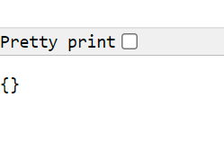

# Configuring Reverse Proxy Guide

## There are 2 options to configure a reverse proxy. 

### You can either manually change this, or change it via commands.

  - [Manually configuring reverse proxy:](#manually-configuring-reverse-proxy)

  - [Configuring reverse proxy via commands](#configuring-reverse-proxy-via-commands)

  - [Potential Blockers:](#potential-blockers)

## Manually configuring reverse proxy:

### 1. `sudo nano /etc/nginx/sites-available/default` First, you must nano into the specified file.

### 2. From there, locate the `try_files $uri $uri/ =404;` ,this will be the line of code that needs to be replaced.

### 3. Replace the previously mentioned line of code with `proxy_pass http://localhost:3000;`.

### 4. Manually test this change via entering your IP address into the browser, you should be automatically transferred to the `:3000` site.

## Configuring reverse proxy via commands
### 1. Enter the following line into your gitbash `sudo sed -i '51s/.*/\t        proxy_pass http:\/\/localhost:3000;/' /etc/nginx/sites-available/default`

### 2. Manually test this change via entering your IP address into the browser, you should be automatically transferred to the `:3000` site.

## Potential Blockers:
### Deploying app before the database is ready
Be careful! You must ensure the database is built before you run the app. This was an error I was receiving.  
When you navigate to the public IP address, it will work as intended. However, when you specify the `/posts` page, you will get the "Pretty print" JSON format.    
You can check if the app is connecting to the database by running `sudo npm install` in the specified app folder. If you receive the error "`database closed`", but the database is running (checked through `systemctl status mongod`), then the app has been deployed before the database has not been instantiated before the app was deployed.  
 
Restart the process but ensure the database has been completed before running the app.