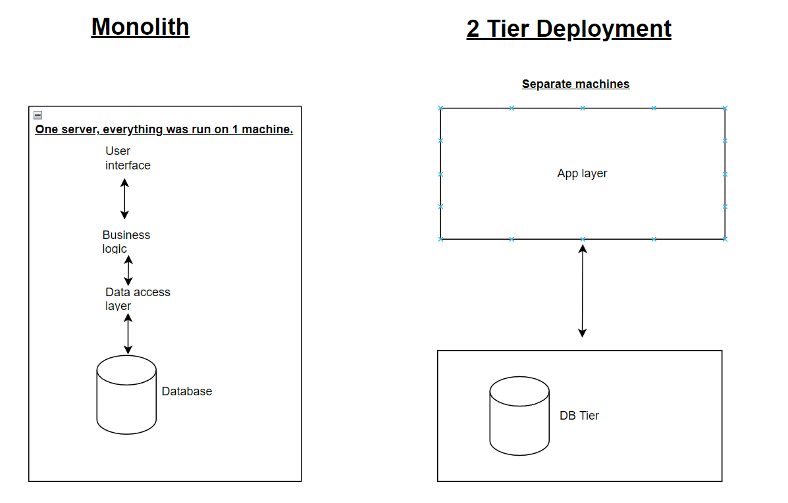

# Monolith vs 2 Tier Architecture

- [Monolith vs 2 Tier Architecture](#monolith-vs-2-tier-architecture)
  - [Monolith](#monolith)
    - [Benefits](#benefits)
    - [Cons](#cons)
  - [2 Tier Architecture](#2-tier-architecture)
    - [Benefits](#benefits-1)
    - [Cons](#cons-1)

## Monolith
A monolith is when everything is run from one server. This is how deployment was run previously, before the advancement of 2 tier deployment.

### Benefits
- A benefit of monoliths are that as everything was run on 1 machine, maintenance was much easier as only one machine had to be maintained.
- Another benefit is that developers can quickly implement features and functionality, as they do not need to worry about managing dependencies between different services.
- Monoliths could also be considered to be simpler to secure, as there are fewer points of entries for attack, compared to distributed systems.

### Cons
- Contrastingly, the dangers of monolith are that everything is run from 1 machine. If there was an outage, or maintenance was required, the whole product would go down.
- Scaling monoliths are also difficult, as vertical scaling (adding more resources to a server) has capacities, whilst horizontal scaling (adding more servers) can be both time-consuming and challenging based on th componenets required.
- Monoliths also do not combine well with Agile principles, as changes to one part of the application may require redeployment of the entire app.
  
## 2 Tier Architecture
2 Tier Architecture is when the logic of an application is divided into 2 tiers, one for the app layer and the other for the database.

### Benefits
- Two-tier architectures are straightforward and easy to understand since they consist of only two main layers: the presentation tier and the data tier. This simplicity can lead to faster development cycles and easier maintenance.
- The direct coupling between the presentation tier and the data tier in a two-tier architecture allows for tight integration between user interfaces and data storage. This can simplify development by reducing the need for complex communication protocols or data transformation layers.
-  Due to their simplicity and efficiency, two-tier architectures can be cost-effective to develop, deploy, and maintain, especially for smaller projects or organizations with limited resources.

### Cons
- Since there are only two tiers in a two-tier architecture, if either the presentation tier or the data tier experiences a failure, the entire application may become unavailable. This lack of redundancy can increase the risk of downtime and impact user experience.
- Two-tier architectures may lack clear separation of concerns between the presentation and data layers. Business logic may become tightly coupled with the user interface or data access logic, making it harder to maintain and test the application components independently.
- In two-tier architectures, direct communication between the presentation tier and the data tier can pose security risks, such as the potential for SQL injection attacks or unauthorized access to sensitive data. Proper security measures, such as input validation and access control, must be implemented to mitigate these risks.
  