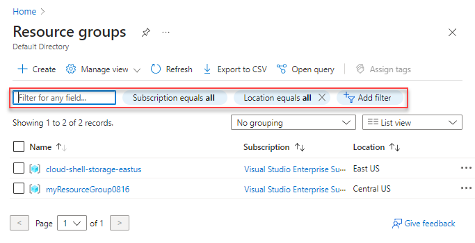
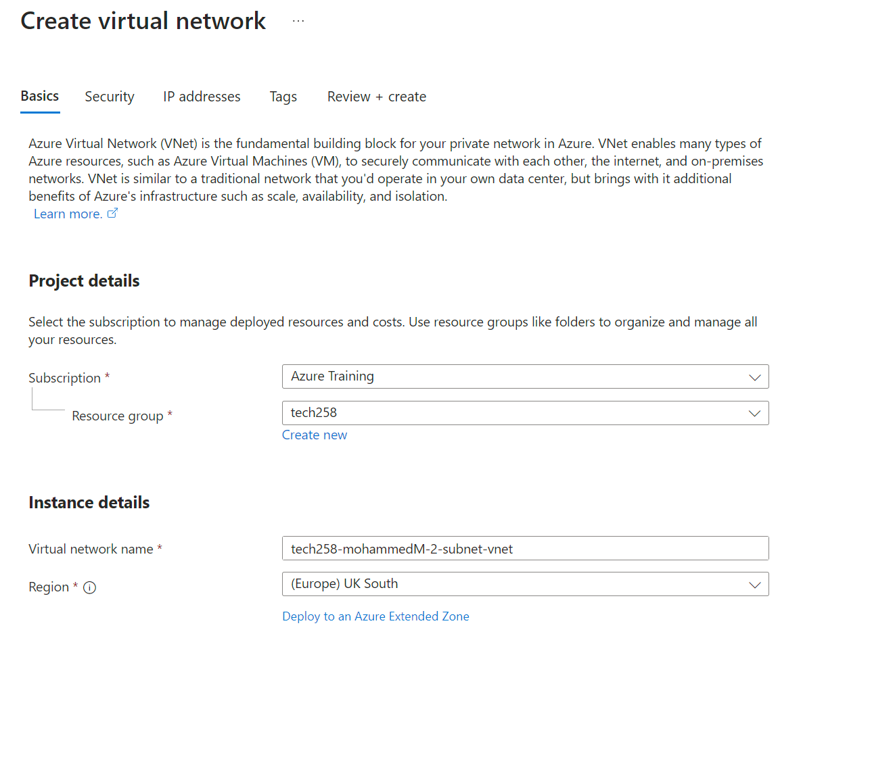
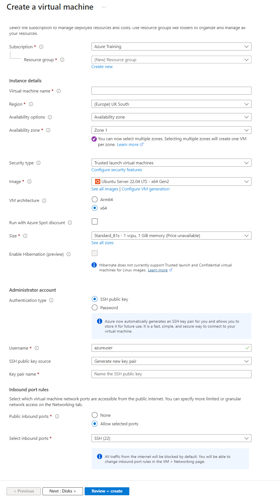

# Guide for a 2 Tier App Deployment on Azure

Welcome to this step-by-step guide on how to do a 2 Tier Deployment on Azure!

- [Guide for a 2 Tier App Deployment on Azure](#guide-for-a-2-tier-app-deployment-on-azure)
    - [Establishing security for your app](#establishing-security-for-your-app)
    - [Creating SSH key on Azure](#creating-ssh-key-on-azure)
    - [Creating VNet on Azure](#creating-vnet-on-azure)
    - [Creating virtual machines on Azure](#creating-virtual-machines-on-azure)
    - [Blockers](#blockers)
  - [1. Ensuring the database has been created before running the app file.](#1-ensuring-the-database-has-been-created-before-running-the-app-file)
  - [2. Connecting the app and database to the correct subnets!](#2-connecting-the-app-and-database-to-the-correct-subnets)

### Establishing security for your app
To ensure no one besides those who are intended to, have access to your app, make sure to create an SSH private-public key pair.

1. `cd .ssh/` to create your key pair in the "ssh" folder, it is vital to create the key pair in the correct directory.
2. `ssh-keygen -t rsa -b 4096 -C "<your.email@email.com>"` This is the command required to generate both your public and private key pair. You will be prompted to enter a password, do this if you desire, however you can also leave it blank.  
You will then be asked to name the key, name it as you wish but make sure it has an appropriate name so you can find it when needs be!
3. `cat <name_of_your_key.pub>` to print out the public key, this will be required for the next step.

### Creating SSH key on Azure
 1. Join a resource group on Azure.  

 1. Search "SSH keys" in the searchbar.
 2. Click on create "SSH Keys".
 3. Select your resource group from the dropdown menu.
 4. Name your key pair appropriately.
 5. Select upload existing public key.
 6. Upload the key, this will be the `cat <name_of_your_key.pub` text that is printed. Ensure there is no blank space!
 7. Next, create a tag of "owner: name" to make billing easier.

### Creating VNet on Azure
1. Search virtual net on Azure.  
![!\[alt text\] (images\Vnet-main-page.PNG)](images/Vnet-main-page.PNG)
2. Click on create virtual net.
3. Name your virtual net appropriately.
4. Configure your address space appropriately.
5. Click on create subnet, you will need to do this twice!
6. First, create a subnet named "public-subnet", the address range should be "10.0.2.0/24".
7. Secondly, create a subnet named "private-subnet", the address range should be "10.0.3.0/24".  

### Creating virtual machines on Azure
1. Search virtual machine on Azure.
2. Click on create virtual machine.

3. Name your virtual machine appropriately, specify whether it is for the database or for the app.
4. Select "Ubuntu Pro 22.04 LTS" as the Image.
5. Select "x64 Gen2" .
6. The size should be "Standard_B1s".
7. Allow access to the ports 80 and 22.
8. Change the username to "adminuser".
9.  Select the keypair you generated earlier.
10. Change the disk size to standard SSD.
11. Use the Vnet you created earlier, use the public subnet for the app vm, and the private subnet for the database vm.
12. Don't forget the owner tag!

### Blockers
If you're encountering any issues, make sure to double check for any easy oversights!

## 1. Ensuring the database has been created before running the app file.
If you do run the app script before the database has been created, you will receive an error as the app itself will not be able to connect with the database.

## 2. Connecting the app and database to the correct subnets!
Remember, the app should connect to the public subnet whilst the database should connect to the private subnet!