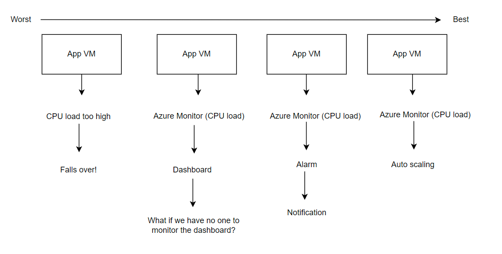
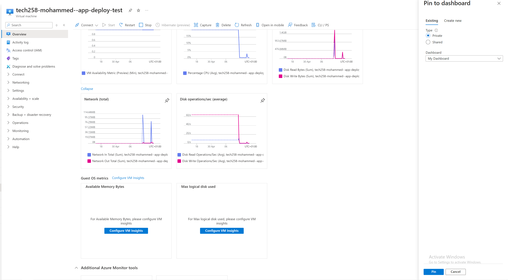
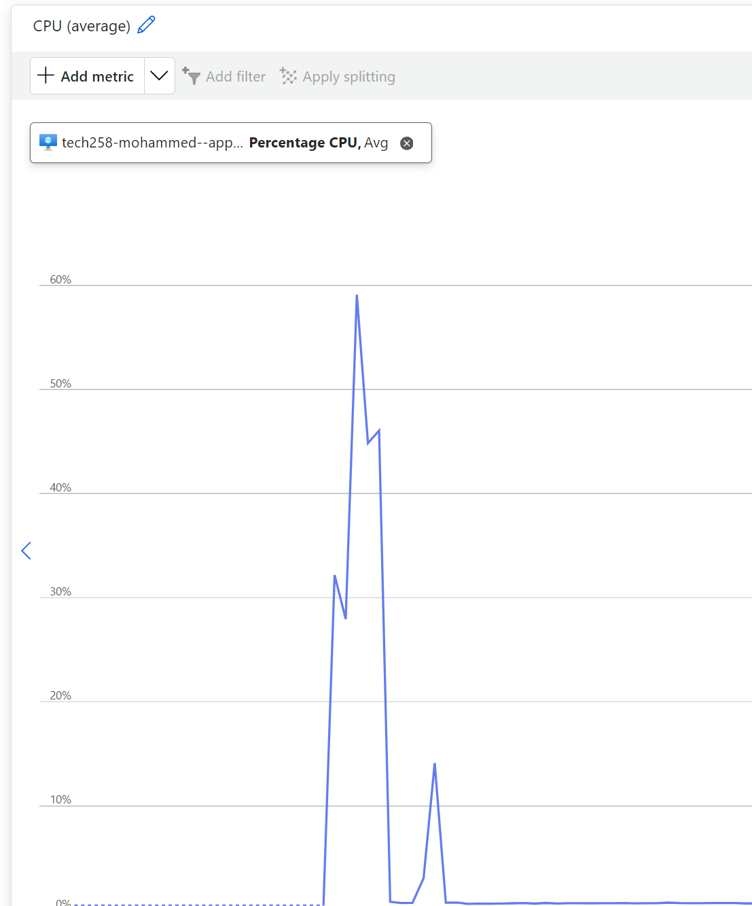
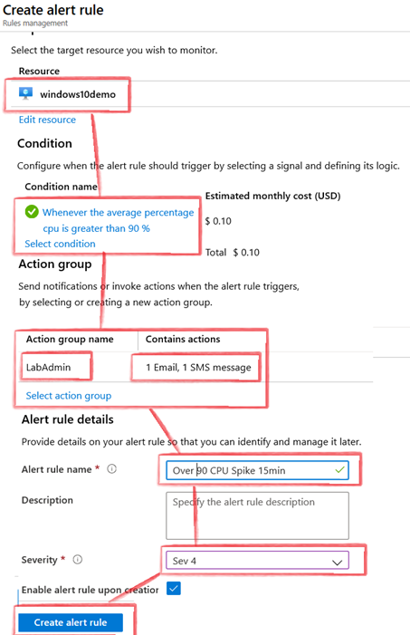
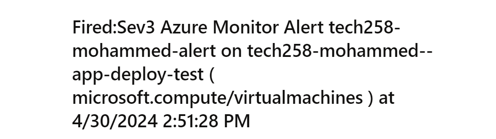

# Azure monitor and alert management

- [Azure monitor and alert management](#azure-monitor-and-alert-management)
    - [What is worst to best in terms of monitoring and responding to load/traffic.](#what-is-worst-to-best-in-terms-of-monitoring-and-responding-to-loadtraffic)
    - [How you setup a dashboard](#how-you-setup-a-dashboard)
    - [How a combination of load testing and the dashboard helped us](#how-a-combination-of-load-testing-and-the-dashboard-helped-us)
    - [How to setup CPU usage alert](#how-to-setup-cpu-usage-alert)

### What is worst to best in terms of monitoring and responding to load/traffic. 

This diagram represents the methods of monitoring your virtual machine, ranging from the worst to the best.  
The best method of monitoring your virtual machine consists of an automated method, as this would be the most efficient and ensures the product maintains uptime.

### How you setup a dashboard 

1. To setup a dashboard, you must navigate to the "Overview" page of your virtual machine. 
2. From there, click on monitoring.
3. You will be presented with a range of graphs containing information, all you need to do is click the "pin" on any one of these graphs, which will then pop up the dashboard creation menu.
4. You can either join an existing dashboard, or create a new one.
### How a combination of load testing and the dashboard helped us 
To conduct load testing, you must first install Apache bench on your server, using the following code `sudo apt-get install apache2-utils`    
To then place the server under a load test, you can run the following code `ab -n 1000 -c 100 http://yourwebsite.com/`  
`ab` specifies Apache Bench.  
`-n` will be the number of requests performed for the benchmarking session., in this case, 1000  
`-c` will be the number of requests sent in each individual wave, in this case, 100.  
The dashboard provides the CPU load graph which showcases the usage of the CPU, thus making it clear when the CPU is under load, as evidenced.

### How to setup CPU usage alert 
To setup a CPU usage alert, navigate to the same monitoring page as before. Azure is very helpful and will offer an integrated option to create an alert.  
Here, you will define the rules of your alert, whilst also either creating an action group, or using a pre-existing group.  
The action group will decide what happens when the alert is triggered, such as an email or perhaps an SMS if deemed more appropriate.

 
The following screenshot showcases the email received when the alert is triggered.
 