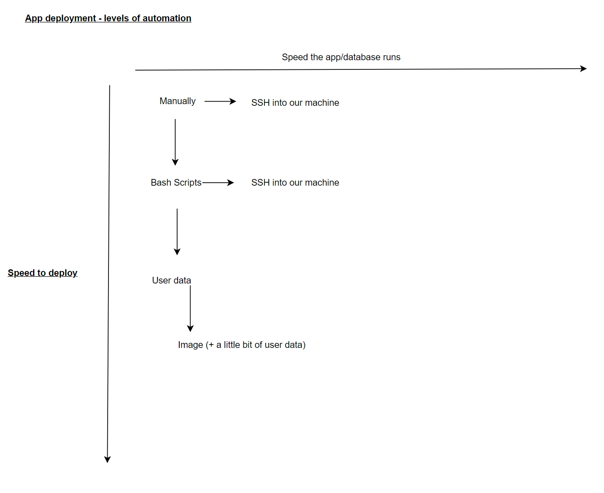

# Welcome to a guide on how to do a user image deployment on Azure.

User images are used when you launch a server with the script you wish to run already sent through to the server. This happens upon booting and it helps automate the process even further.
 

- [Welcome to a guide on how to do a user image deployment on Azure.](#welcome-to-a-guide-on-how-to-do-a-user-image-deployment-on-azure)
    - [How to set up user data](#how-to-set-up-user-data)
    - [How to set up  images](#how-to-set-up--images)
    - [Verify](#verify)
    - [Patience is a virtue!](#patience-is-a-virtue)
    - [What is an Azure Image - what does it include, what is the equivalent called on AWS](#what-is-an-azure-image---what-does-it-include-what-is-the-equivalent-called-on-aws)
    - [What is not included in the image and why](#what-is-not-included-in-the-image-and-why)
    - [What is the side-effect of creating an image of a VM on Azure? (After creating the image, can you log back into the VM used to create the image?)](#what-is-the-side-effect-of-creating-an-image-of-a-vm-on-azure-after-creating-the-image-can-you-log-back-into-the-vm-used-to-create-the-image)
    - [The little bit of user data needed to get the app running with the posts page (and what can be commented out if you don't need the posts page to work)](#the-little-bit-of-user-data-needed-to-get-the-app-running-with-the-posts-page-and-what-can-be-commented-out-if-you-dont-need-the-posts-page-to-work)

### How to set up user data
Setting up user data is incredibly simple! All you have to do is navigate to the "Advanced" section of a virtual machine creation, tick the box that enables user data and submit your code. That is it!

### How to set up  images
To set up images, do the following:
1. Navigate to the original VM and click on the "capture" button.
2. Click "No, capture only a managed image", rename the image appropriately, do the relevant tags and then create.
3. You must do this for both the database and the app.
4. Create new VMs for both.
5. Click on "see all images", click "my images" and select the desired image.
6. Fill out the details as needed and there you go! Your image is ready to be deployed.

### Verify
You can verify the database is online by SSH'ing into the database server.  
To verify the app is online, all you have to do is enter the public IP into the URL.

### Patience is a virtue!
Let the database and the app build once you've launched the server! There is no need to rush!
You can use the `nano /var/log/cloud-init-output.log` command to see the progress of the installation.

### What is an Azure Image - what does it include, what is the equivalent called on AWS
An Azure image is a templated used to create virtual machines with predefined configurations.    
Azure images include operating systems, applications and software and configuration settings.    
The AWS equivalent is called AMI, Amazon Machine Images.
### What is not included in the image and why
User-specific data and configuration is not included in images. This is in order to ensure the images remain generic and reusable across different environments.  
Dynamic state and Runtime dependencies are also not included in images. These aren't included as images would then become less portable and harder to manage.  
Sensitive credentials and Keys are not included in images as this would pose security risks, especially as images can be shared or accessed by multiple users.
### What is the side-effect of creating an image of a VM on Azure? (After creating the image, can you log back into the VM used to create the image?)
A side effect of creating an Azure vm image is that the VM becomes "generalised" as it is used as a template.  
Logging back into the original VM can be impacted, as the original VM has to be shut down during the image creation process. This may leave it shut down when you try to re-access the VM.

### The little bit of user data needed to get the app running with the posts page (and what can be commented out if you don't need the posts page to work)
For your app script to work, you must make sure your script does the following:
- set DB_HOST
- cd into the app folder
- run npm install
- run the app with pm2
