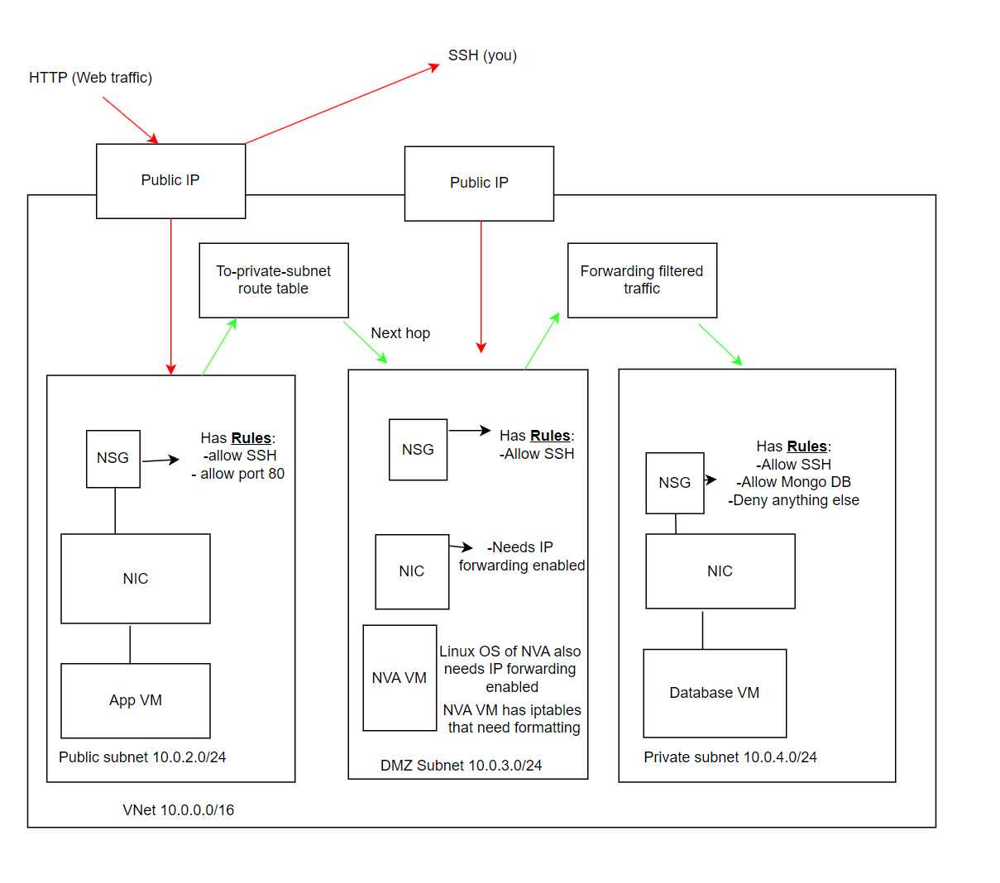

# Network virtual appliances

- [Network virtual appliances](#network-virtual-appliances)
    - [Diagram explanation](#diagram-explanation)
    - [Create new Vnet, consisting of the public, DMZ and private subnets](#create-new-vnet-consisting-of-the-public-dmz-and-private-subnets)
    - [Create new Database VM](#create-new-database-vm)
    - [Create new App VM](#create-new-app-vm)
    - [Check your /Posts page to ensure the site is functioning as intended, before you complete the next step](#check-your-posts-page-to-ensure-the-site-is-functioning-as-intended-before-you-complete-the-next-step)
    - [Create NVA VM](#create-nva-vm)
    - [Create route table](#create-route-table)
    - [IP configuration](#ip-configuration)
    - [Code explained](#code-explained)
      - [Key:](#key)



 


### Diagram explanation
The diagram explains the added security of a DMZ subnet. <br>
DMZ stands for demilitarised zone.  It refers to a segmented or isolated area of a network that sits between an organization's internal network (intranet) and an external network (usually the internet). The DMZ is designed to provide an additional layer of security by placing certain resources and services in a neutral zone that is more exposed to external threats than the internal network but less exposed than the public internet. <br> <br>
The DMZ subnet provides an extra layer of security, as opposed to using only the public and private subnet. <br>
For the App VM to communicate with the Database VM, the traffic will be re-routed through the Network Virtual Appliance (NVA) VM. This ensures that only traffic we wish to access the Database VM can do so. <br>
As you can see, the Database VM has not been set a public IP. This is because we want to keep our database secure, therefore not allowing unwanted access from the public. <br>
Red lines indicate danger zones, areas where we are susceptible to outside attacks. <br>
Green lines indicate safe zones, areas where only intended traffic can access.

### Create new Vnet, consisting of the public, DMZ and private subnets
1. First, click on the create Virtual Network option

2. Second, name your virtual net appropriately.

3. Third, create your subnets as followed, we need 3 separate subnets for the 3 different VMs.

4. The private subnet is configured slightly differently, as you enable the private subnet option.
   

### Create new Database VM
1. Create a database VM using the image you have created earlier, for help of efficiency.
2. The rest of the configuration is as standard, but remember to use the new 3 subnet virtual network you created earlier, picking the private subnet!
3. The networking setting for the database should be as pictured below. Make sure there is no public IP, as we do not want any unwanted outside traffic accessing our database!
   

### Create new App VM
1. Create the App VM using the App image you have created previously, for ease of use.
2. The rest of the configuration is as standard, but remember to use the new 3 subnet virtual network you created earlier, picking the public subnet!
3. Input the small amount of user data needed for your VM, make sure you insert the correct private IP address for the DB_HOST environment variable.

### Check your /Posts page to ensure the site is functioning as intended, before you complete the next step

### Create NVA VM
1. Create the NVA VM using the Image "Ubuntu 22.04 LTS".
2. The rest of the configuration is as standard, but remember to use the new 3 subnet virtual network, picking the DMZ subnet!


### Create route table
Next, we must create a route table. A route table determines where exactly to forward packets of data. It does this, by specifying the destination network and the next hop address. <br>
So according to our diagram, the data from the App VM, will have a "next hop" address of the NVA VM, whilst the destination network is the Database VM, as this is where we want our packets of data to be sent.

These are the steps to creating a route table:
1. Click the create button once you have searched "Route table".

2. Name your route table appropriately.

3. Once on your route table, click the "Routes" option in "Settings".

4. Add the route as specified. As mentioned earlier, the destination address is our Database VM whilst the next hop address is our NVA VM.

5. Next, we must assign a subnet associate. This is because a route table cannot be associated to virtual networks, you must associate a route table to each subnet you want the route table associated to.


### IP configuration
We have now reached the end stage. All of your VMs should be running, as well as the route table created. The next stage, is to configure the IP so the packets of data will be correctly forwarded.
1. To do this on Azure, you must tick the "Enable IP forwarding" option, as well as the "ipconfig1" option, both found in "IP configuration" of the subnet.

2. As shown on the diagram, the next stage is to configure the IP in the Linux OS of our NVA VM. To do this, SSH into the NVA VM and enter the code `sudo nano /etc/sysctl.conf`. This will open the system configuration file, where you must uncomment the line following: <br>
`# Uncomment the next line to enable packet forwarding for IPv4` <br>
If done correctly, the line uncommented should be: <br>
`net.ipv4.ip_forward=1`


3. Once that has been configured, enter the following code: <br>
`sudo sysctl -p net.ipv4.ip_forward = 1`
4. You have now configured the IP address in your Linux OS too, so check your /posts page once again and it should be working as intended! Job done!

### Code explained
`sudo sysctl -p net.ipv4.ip_forward = 1`:<br>
`sudo`: The sudo command allows a permitted user to execute a command as the superuser or another user. <br>
`sysctl`: The sysctl command in Linux is used to modify kernel parameters at runtime. It provides a way to read and change kernel parameters on the fly without requiring a reboot. <br>
`-p`: The -p option with sysctl is used to load settings from a configuration file. In this context, sysctl -p will load settings from the default configuration file (/etc/sysctl.conf). <br>
`net.ipv4.ip_forward=1`: This is the specific parameter being modified. net.ipv4.ip_forward controls whether IP forwarding is enabled (1) or disabled (0). By setting net.ipv4.ip_forward=1, you are enabling IP forwarding, allowing the system to forward packets between interfaces. <br> <br>

```#!/bin/bash

# configure iptables

echo "Configuring iptables..."

# Allow all traffic on the loopback interface (localhost)
sudo iptables -A INPUT -i lo -j ACCEPT
sudo iptables -A OUTPUT -o lo -j ACCEPT

# Accept incoming packets that are part of established or related connections
sudo iptables -A INPUT -m state --state ESTABLISHED,RELATED -j ACCEPT

# Accept outgoing packets that are part of established connections
sudo iptables -A OUTPUT -m state --state ESTABLISHED -j ACCEPT

# Drop incoming invalid packets (e.g., malformed or unexpected packets)
sudo iptables -A INPUT -m state --state INVALID -j DROP

# Allow incoming SSH (TCP port 22) connections (new and established)
sudo iptables -A INPUT -p tcp --dport 22 -m state --state NEW,ESTABLISHED -j ACCEPT
sudo iptables -A OUTPUT -p tcp --sport 22 -m state --state ESTABLISHED -j ACCEPT

# Uncomment the following lines if you want to restrict SSH access to NVA from specific subnet
# Allow incoming SSH (TCP port 22) connections only from source subnet 10.0.2.0/24
# sudo iptables -A INPUT -p tcp -s 10.0.2.0/24 --dport 22 -m state --state NEW,ESTABLISHED -j ACCEPT
# sudo iptables -A OUTPUT -p tcp --sport 22 -m state --state ESTABLISHED -j ACCEPT

# Uncomment the following lines if you want to allow NVA to act as a jumpbox for outgoing SSH connections
# Allow outgoing SSH (TCP port 22) connections from NVA to other servers
# sudo iptables -A OUTPUT -p tcp --dport 22 -m conntrack --ctstate NEW,ESTABLISHED -j ACCEPT
# sudo iptables -A INPUT -p tcp --sport 22 -m conntrack --ctstate ESTABLISHED -j ACCEPT

# Allow TCP traffic from subnet 10.0.2.0/24 to subnet 10.0.4.0/24 on destination port 27017 (MongoDB)
sudo iptables -A FORWARD -p tcp -s 10.0.2.0/24 -d 10.0.4.0/24 --destination-port 27017 -m tcp -j ACCEPT

# Allow ICMP (ping) traffic from subnet 10.0.2.0/24 to subnet 10.0.4.0/24
sudo iptables -A FORWARD -p icmp -s 10.0.2.0/24 -d 10.0.4.0/24 -m state --state NEW,ESTABLISHED -j ACCEPT

# Set default policy to drop all incoming packets (can be modified based on specific needs)
sudo iptables -P INPUT DROP

# Set default policy to drop all forwarded packets (can be modified based on specific needs)
sudo iptables -P FORWARD DROP

echo "Done!"
echo ""

# Make iptables rules persistent by installing iptables-persistent package
echo "Make iptables rules persistent..."
sudo DEBIAN_FRONTEND=noninteractive apt install iptables-persistent -y
echo "Done!"
echo ""
```

#### Key:
1. `-A` represents append.
2. `--sport` represents source port
3. `-m state` uses the "state" module to match packets based on their connection state.
4. `--state ESTABLISHED` matches packets that are associated with an established connection.
5. `-j ACCEPT` specifies the action to take if the packet matches all the previous conditions, in this case, the action is to accept.