# NVA Diagrams

### Why NVA?
 You can buy an Azure firewall (quite expensive).
 Need to make sure only traffic we desire, is allowed through. So only traffic we want to the DB, is allowed through the private subnet.
 To do this, we need to set up 2 routes.

### Diagram explanation
The diagram explains the added security of a DMZ subnet.  
DMZ stands for demilitarised zone.  It refers to a segmented or isolated area of a network that sits between an organization's internal network (intranet) and an external network (usually the internet). The DMZ is designed to provide an additional layer of security by placing certain resources and services in a neutral zone that is more exposed to external threats than the internal network but less exposed than the public internet.    
The DMZ subnet provides an extra layer of security, as opposed to using only the public and private subnet.  
The "Public IP" connection to the private subnet needs to be deleted, as we do not want outside access to our database.

### Create new Vnet, consisting of the public, DMZ and private subnets
1. First, click on the create Virtual Network option
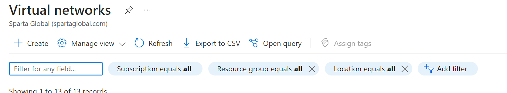
2. Second, name your virtual net appropriately.
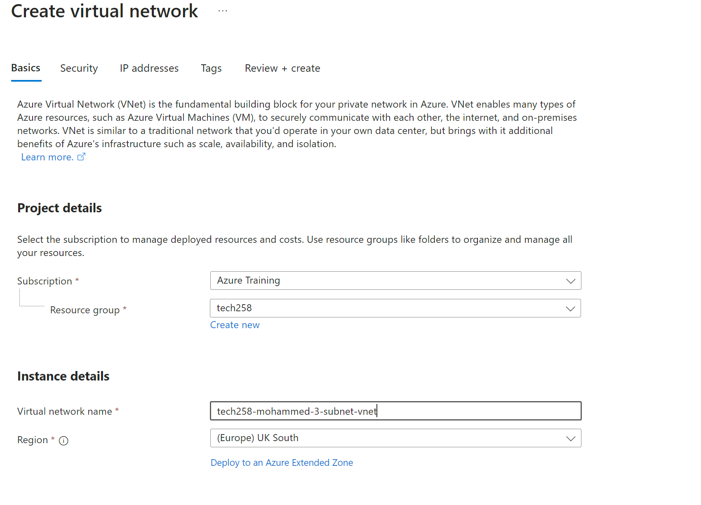
3. Third, create your subnets as followed, we need 3 separate subnets for the 3 different VMs.
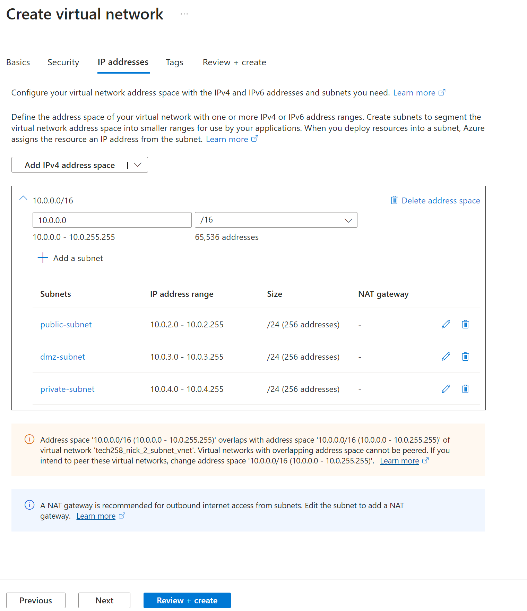
4. The private subnet is configured slightly differently, as you enable the private subnet option.
   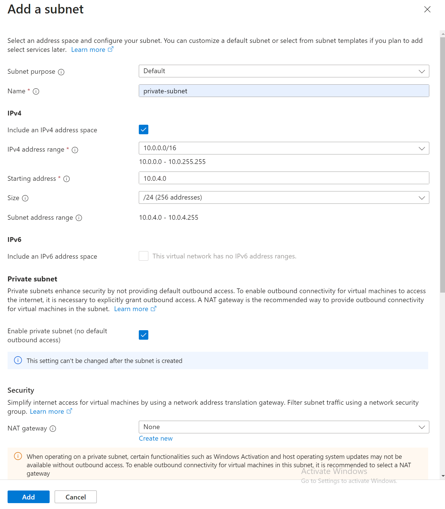

### Create new database VM
1. Create a database VM using the image you have created earlier, for help of efficiency.
2. The networking setting for the database should be as pictured below. Make sure there is no public IP, as we do not want any unwanted outside traffic accessing our database!
   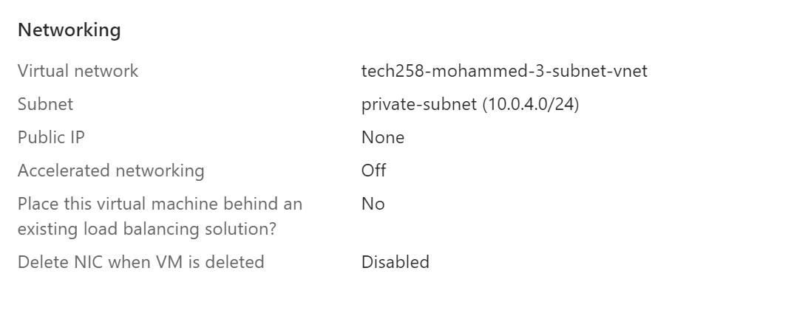

### Create route table
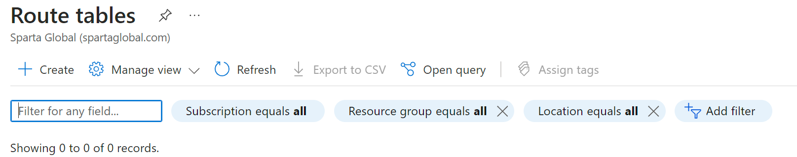
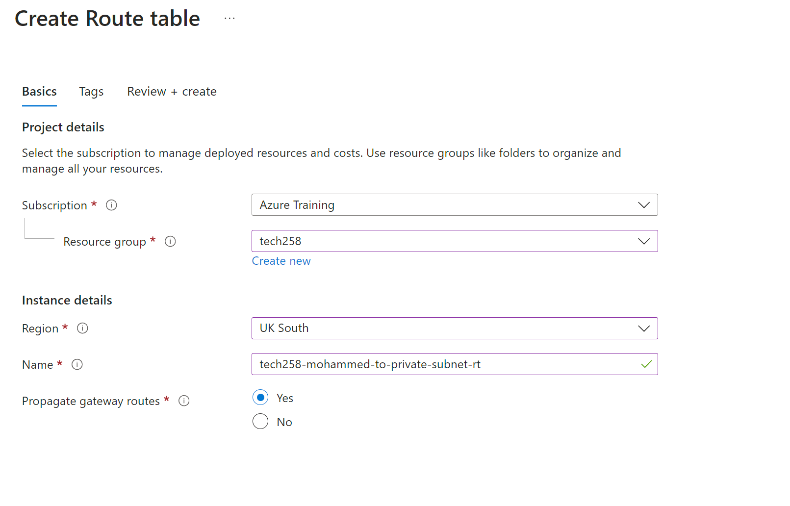
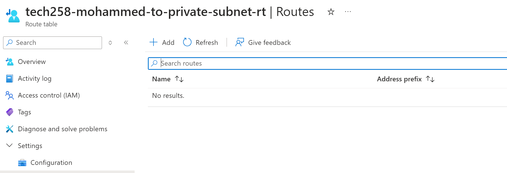
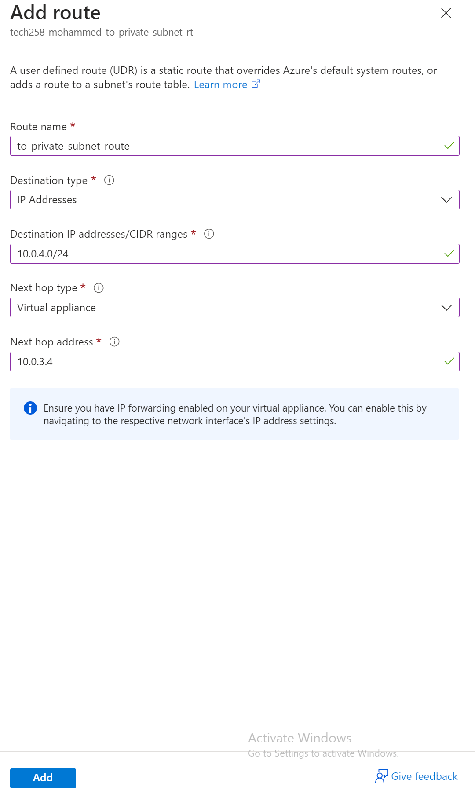
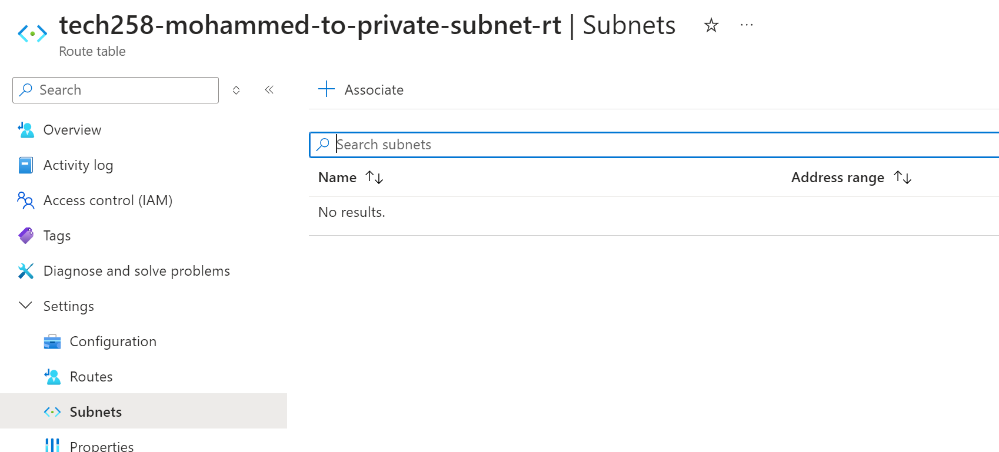

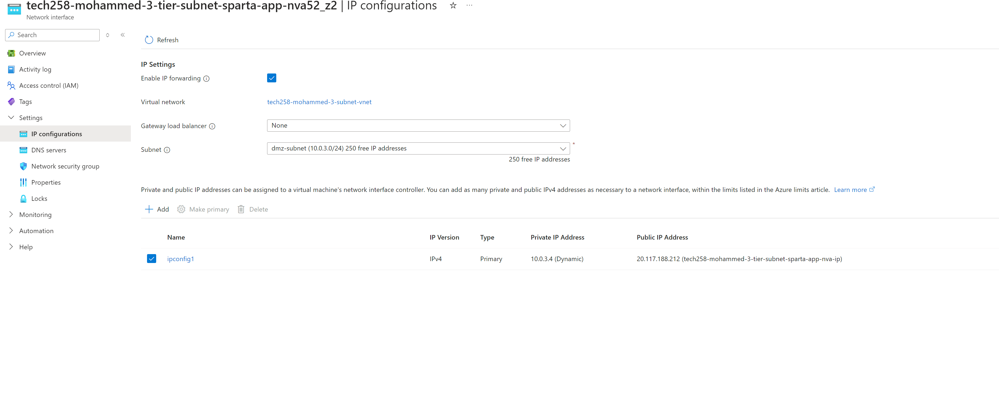
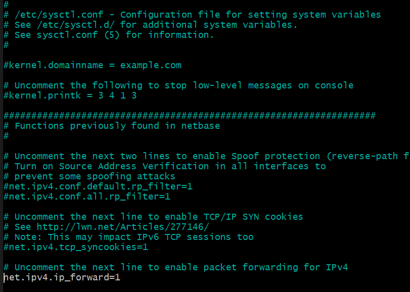
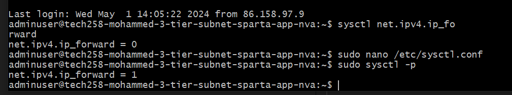

`ping <ip address>` to check if app can connect to the database

steps on how to do it, with explanations and essential screenshots 
include your own diagram on the 3-subnet architecture 
work out what the iptables commands do in the script you were given and add appropriate comments where prompted 
