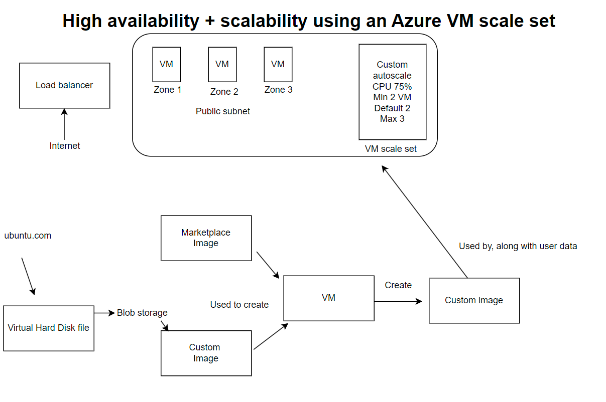
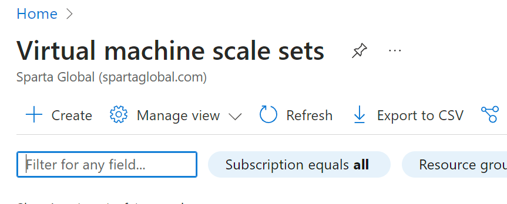
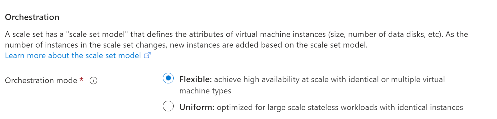
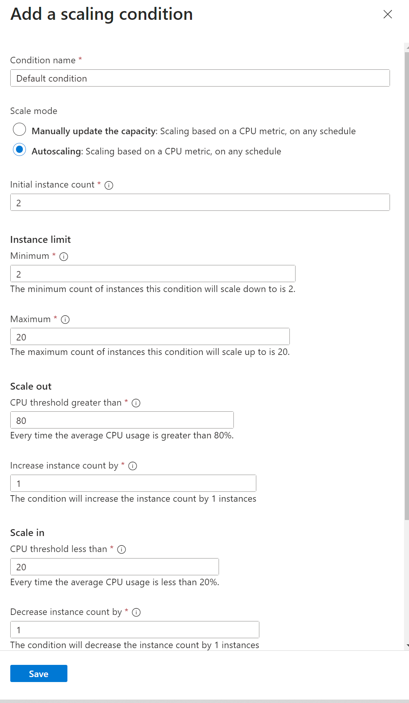
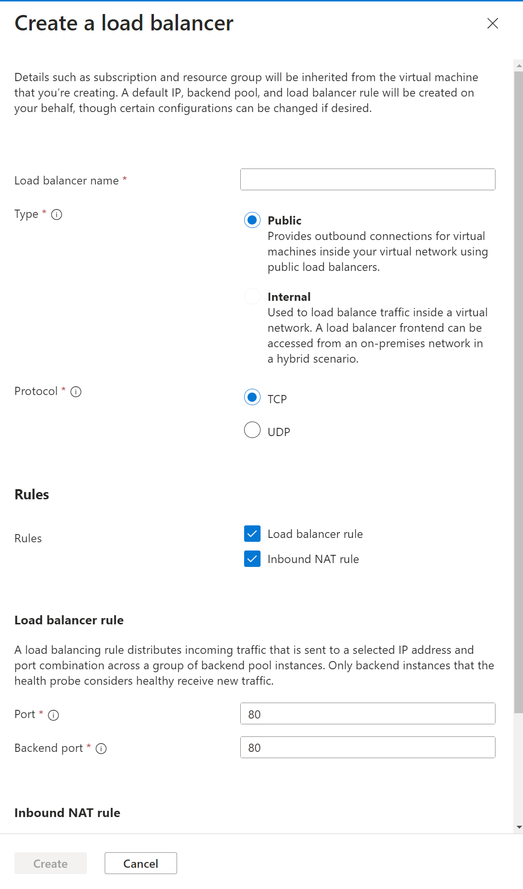
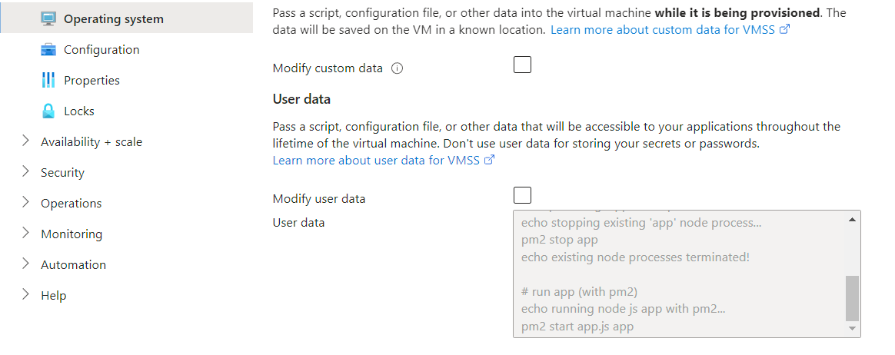

# Autoscaling

In the example above, if the CPU load exceeds 75% (defined in the custom autoscale)then the scale set will launch a new instance.  
By default, there is a minimum of 2 VMs which means if one does go down, the other one will remain running.
- [Autoscaling](#autoscaling)
    - [High availability](#high-availability)
    - [High scalability](#high-scalability)
    - [Load balancers](#load-balancers)
    - [Prerequisites of making a Scale set](#prerequisites-of-making-a-scale-set)
    - [How to make a Scale set](#how-to-make-a-scale-set)
    - [How to test the Scale set works](#how-to-test-the-scale-set-works)
      - [Apache Bench - Load Testing](#apache-bench---load-testing)
    - [How to manage instances](#how-to-manage-instances)
    - [Steps on how to create an unhealthy instance (for testing) and WHY it is considered healthy/unhealthy](#steps-on-how-to-create-an-unhealthy-instance-for-testing-and-why-it-is-considered-healthyunhealthy)
    - [How to SSH into an instance in your Scale set](#how-to-ssh-into-an-instance-in-your-scale-set)
    - [How to delete a Scale set and all of the connecting parts](#how-to-delete-a-scale-set-and-all-of-the-connecting-parts)

Virtual Machine scale sets are used to improve both availability and scalability.    

### High availability
They improve availability by having different VM's in different availability zones, thus ensuring there is still production incase of a failure.  

### High scalability
A scale set also improves scalability, as there are now a minimum of 2 VM's operating, as opposed to just one. An increase in VMs allows for horizontal scaling, which is when you increase the number of servers.  

### Load balancers
Load balancers can be used in conjunction with the virtual machine scale set. They are separate entities, but can be used together.    
Using a load balancer will increase scalability, as the load balancer ensures that there is even distribution amongst the virtual machines, hence the load is balanced.

### Prerequisites of making a Scale set
Before you make a Scale set, you must have the following:
1. A custom Image to create the Scale set, alongside the user data needed for this.
2. Ensure your custom Image works and creates a VM functioning as intended.
3. Ensure your user data provides the results required.
### How to make a Scale set
To make a Scale set, you need to:
1. Click create new Scale set.
   
2. Name it appropriately.
3. Choose whether you want the orchestration mode to be flexible or uniform.
   
4. Choose what type of scaling you desire, outline the custom scaling parameters.
5. Choose the instance count.
   
6. Choose your custom Image.
7. Fill out security details as appropriate.
8. Choose the correct Network details.
9.  Create a load balancer, to use the ports you need.
    
10.  Select "Enable health monitoring" and "Enable automatic repairs".
11. Input your user data in the Advanced section.
12. Review all your details are correct, and create.
 
### How to test the Scale set works
To test the scale set works, you can check the public IP address. If it works as intended, it should redirect you to your homepage.
   
To test the health monitoring aspect of a Scale set, we can do this using Apache Bench.  
Load testing is testing the behaviour of a system under specific load conditions. 

#### Apache Bench - Load Testing
1. Install Apache Bench using the command:  
   `sudo apt-get install apache2-utils`
2. Check installation using the command:  
   `ab`
3. We are testing our CPU, to do this, we must increase CPU Usage. We can do this via the following:  
`ab -n 1000 -c 100 http://yourip/`  
`-n` denotes the total number of requests whilst `-c` is the speed of requests being sent. If this was not enough to spike the CPU, you can re-run the test with increased numbers.

### How to manage instances
Reimaging is when you restore a server back to its original state. Upgrading involves updating the existing software to a newer version, whilst retaining user data and configurations.  
If you have made an error in your user data, you can alter this if you do the following:
1. Go to "Operating System" on the "Settings" page.
2. Check your "User data" and correct any errors.  

### Steps on how to create an unhealthy instance (for testing) and WHY it is considered healthy/unhealthy
To create unhealthy instances, you need to implement failure conditions, such as:
- Resource overload
- Network issues
- Service outages
- Application-level failures

Creating an intentionally unhealthy instance for testing purposes helps evaluate the resilience and fault tolerance of your system.  You can identify weaknesses, optimize recovery strategies, and ensure that your system behaves predictably under adverse conditions.  The reasons an instance is marked as healthy or unhealthy often depend on predefined criteria, thresholds, and the specific health checks implemented in your system's monitoring and management processes.

### How to SSH into an instance in your Scale set
To SSH into your instance, you must do the following:
1. Copy and paste the provided code by Azure, when you click on the "Connect" tab.
2. You need to change the private IP address that Azure provide, to the public IP address of the load balancer.
3. Include the code `-p <port number>` before you specify the IP address. This will specify what port you are going to use, so you can access the instance in particular.
### How to delete a Scale set and all of the connecting parts
To delete a Scale set, you need to delete 3 items:
1. The Scale set itself.
2. The load balancer
3. The public IP used by the Scale set.
It has to be in this order, as the public IP is not deletable whilst it is in use by the load balancer.