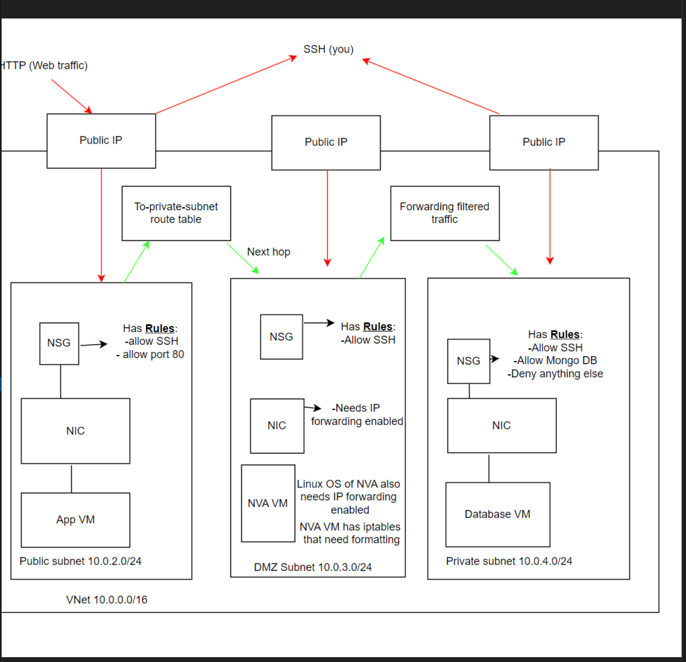

# An introduction to Azure

- [An introduction to Azure](#an-introduction-to-azure)
  - [The basics of Azure](#the-basics-of-azure)
  - [Azure regions and availability zones: how they work and include up-to-date diagrams to help](#azure-regions-and-availability-zones-how-they-work-and-include-up-to-date-diagrams-to-help)
  - [How is Azure structured/organised?](#how-is-azure-structuredorganised)
  - [What types of services does Azure provide?](#what-types-of-services-does-azure-provide)
  - [Ways to access Azure?](#ways-to-access-azure)
  - [Explain the difference between Azure and Azure DevOps](#explain-the-difference-between-azure-and-azure-devops)
  - [Why use the Azure Pricing Calculator?](#why-use-the-azure-pricing-calculator)

Microsoft Azure is a cloud computing platform and services suite, which provides a wide range of cloud services for building, deploying and managing applications and services through Microsoft-managed data centers.

## The basics of Azure 
- Overview of Microsoft Azure as a cloud computing platform.
- Key features and benefits.
- Introduction to Azure Resource Manager (ARM) and Azure Portal.
- Provides a wide range of services, such as computing, storage, networking, databases and more.
## Azure regions and availability zones: how they work and include up-to-date diagrams to help 
- Azure regions are geographical areas that contain data centers. Each region is designed to be independent of other regions, providing redundancy and isolation. Azure regions are spread across the globe to ensure low latency and high availability for customers
-  Availability zones are physically separate data centers within an Azure region. Each availability zone is connected through high-speed, private fiber-optic networks and is designed to be independent of other zones within the same region. This architecture provides redundancy and resiliency, allowing applications to remain available even if one availability zone fails.
- The diagram below depicts how the Azure availability zones work, as they collaborate with Microsoft data centers.

## How is Azure structured/organised? 
- Azure's organisational structure is hierarchical, which provides a logical way to organise and manage resources. The key components include subscriptions, resource groups, resources and management groups.
- Subscriptions are the fundamental unit of billing in Azure. They represent the agreement between the customer and Microsoft to use Azure services. There are limits and quotas to every subscription.
- A resource group is a logical container that holds related Azure resources for an application or a project. Resources within a resource group share the same lifecycle, permissions and policies.
- Resources are the components that make up Azure services, such as virtual machines, databases, storage accounts and web apps.
- Management groups are a hierarchical structure for organizing Azure subscriptions and resources across an organization.

## What types of services does Azure provide? 
- Compute:
    - Virtual Machines (IaaS): On-demand, scalable virtual machines with customizable configurations, including Windows and Linux VMs.
- Storage:
    - Blob Storage
    - File Storage
    - Disk Storage
    - Data Lake Storage
    - Azure Backup
- Networking:
    - Virtual Network
    - Azure Load Balancer
    - Azure VPN Gateway
    - Azure DNS
- Databases:
    - Azure SQL Database
    - Azure Cosmos DB
    - Azure Database for MySQL/PostgreSQL
    - Azure Redis Cache
- AI/ML:
    - Azure Cognitive Services
    - Azure Machine Learning
    - Azure Bot Service
- IoT:
    - Azure IoT Hub
    - Azure IoT Central
    - Azure IoT Edge
    - With IaaS, Azure provides virtualized computing resources, such as virtual machines, storage, and networking, over the internet.
    - Users have full control over the operating systems, applications, and configurations of the virtual machines.
    - Examples include Azure Virtual Machines, Azure Virtual Network, and Azure Disk Storage.
- PaaS:
    - PaaS offerings provide a platform and environment for developers to build, deploy, and manage applications without managing underlying infrastructure.
    - Azure handles the infrastructure, runtime, middleware, and other services, allowing developers to focus on application development and deployment.
    - Examples include Azure App Service, Azure SQL Database, and Azure Functions.
- SaaS:
    - SaaS offerings deliver software applications over the internet on a subscription basis, eliminating the need for users to install, maintain, and manage the software locally.
    - Azure offers various SaaS applications and services, including Microsoft 365 (formerly Office 365), Dynamics 365, and Azure DevOps.
## Ways to access Azure? 
- Azure Portal:
  - The Azure Portal is a web-based interface for managing Azure resources. It provides a graphical user interface (GUI) for accessing and managing Azure services.
  - Users can perform tasks such as creating and managing resources, monitoring usage and performance, configuring security settings, and viewing billing information.
  - The Azure Portal offers a user-friendly experience with interactive dashboards, customizable views, and built-in tutorials and guides.
- Azure CLI (Command-Line Interface):
  - Azure CLI is a cross-platform command-line tool for managing Azure resources. It provides a command-line interface (CLI) that allows users to interact with Azure services from a terminal or command prompt.
  - Users can perform tasks such as creating, configuring, and deleting resources, querying resource properties, and executing scripts for automation.
  - Azure CLI is scriptable and can be integrated into automated workflows and DevOps pipelines.
- Azure PowerShell:
  - Azure PowerShell is a command-line shell and scripting language built on top of the Windows PowerShell framework. It provides cmdlets (commands) for managing Azure resources.
  - Users can perform tasks similar to those in the Azure CLI, but with PowerShell syntax and capabilities.
  - Azure PowerShell integrates seamlessly with other PowerShell modules and workflows, making it suitable for Windows-centric environments and automation scenarios.
- Azure REST API:
  - Azure exposes a comprehensive set of REST APIs for programmatic access to Azure services. These APIs allow developers to build custom applications, automate tasks, and integrate Azure services with third-party systems.
  - Users can perform tasks such as provisioning resources, managing configurations, querying status and metrics, and interacting with Azure services programmatically.
  - Azure REST APIs are language-agnostic and can be accessed from any programming language or platform that supports HTTP requests.
- Azure Mobile App:
  - The Azure mobile app provides a mobile-friendly interface for monitoring and managing Azure resources on the go.
  - Users can view resource health and status, receive notifications and alerts, check billing and usage information, and perform basic management tasks.
  - The Azure mobile app offers convenience and flexibility for users who need to stay connected to their Azure resources while away from their computers.
## Explain the difference between Azure and Azure DevOps 
- Azure:
    - Definition: Azure is a cloud computing platform offered by Microsoft that provides a wide range of services for building, deploying, and managing applications and services in the cloud.
    - Purpose: Azure enables organizations to leverage cloud resources to build, deploy, and scale applications and services without the need to invest in on-premises infrastructure.
    - Services: Azure offers a broad portfolio of services across various categories, including compute, storage, networking, databases, AI/ML, IoT, analytics, security, and more.
    - Use Cases: Azure is used for a variety of use cases, such as hosting web applications, running virtual machines, storing and analyzing data, building AI-powered applications, and deploying IoT solutions.
    - Key Features: Scalability, flexibility, reliability, security, global presence, and pay-as-you-go pricing are some of the key features of Azure.
- Azure DevOps:
    - Definition: Azure DevOps is a set of cloud-based collaboration tools provided by Microsoft for software development and DevOps practices.
    - Purpose: Azure DevOps facilitates the end-to-end software development lifecycle by providing tools for version control, build automation, continuous integration/continuous deployment (CI/CD), release management, project management, and collaboration.
    - Components: Azure DevOps consists of several components, including Azure Repos (version control), Azure Pipelines (build and release automation), Azure Boards (project management), Azure Artifacts (package management), and Azure Test Plans (test management).
    - Use Cases: Azure DevOps is used by development teams to streamline and automate various aspects of the software development process, including code collaboration, build and release automation, agile planning, and testing.
    - Key Features: Integration with popular development tools and platforms, customizable workflows, automated testing and deployment, real-time collaboration, and reporting and analytics are some of the key features of Azure DevOps.
## Why use the Azure Pricing Calculator? 
- The Azure Pricing Calculator is a valuable tool provided by Microsoft for estimating the costs associated with using Azure services. Here's why it's beneficial to use the Azure Pricing Calculator:

- Estimating Costs:
    - The Azure Pricing Calculator allows users to estimate the costs associated with deploying and using Azure services based on their specific requirements and usage patterns.
    - Users can select the Azure services they plan to use, specify the quantity and configuration of resources, and receive an estimated monthly cost breakdown.
- Key Features:
    - Customization: Users can customize their cost estimates by selecting the specific Azure services, regions, resource configurations, and usage quantities.
    - Cost Breakdown: The calculator provides a detailed breakdown of estimated costs by service, region, and resource type, allowing users to identify cost drivers and optimize spending.
    - Comparison: Users can compare costs across different Azure regions, service tiers, and usage scenarios to make informed decisions and identify cost-saving opportunities.
    - Export: Users can export cost estimates and share them with stakeholders for review and approval.
- How to Use Effectively:
    - Start by selecting the Azure services you plan to use from the list of available services.
    - Specify the quantity and configuration of resources for each service, such as the number of virtual machines, storage capacity, and data transfer volume.
    - Choose the Azure regions where you intend to deploy resources to see how regional pricing affects costs.
    - Review the estimated monthly cost breakdown and adjust configurations as needed to optimize spending.
  - Experiment with different scenarios and configurations to find the most cost-effective solutions for your requirements.