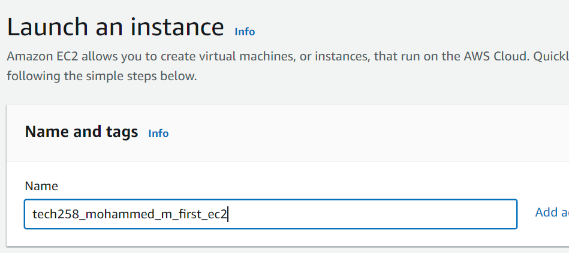
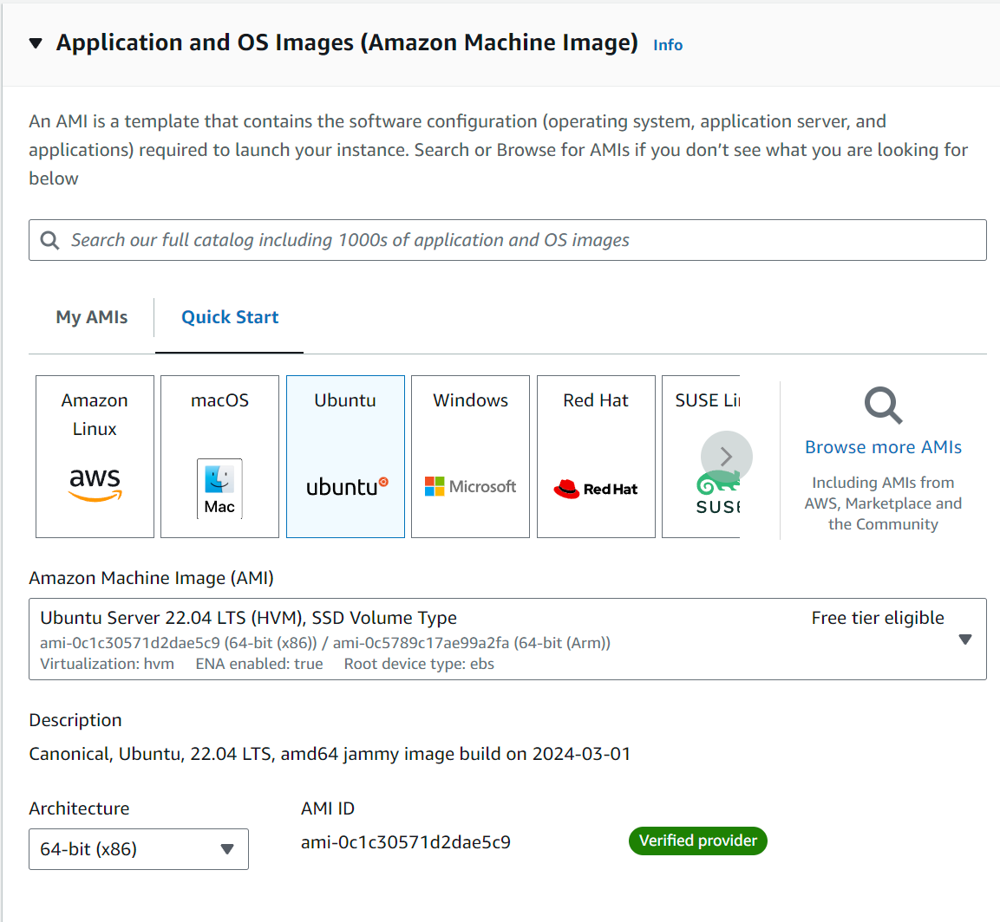
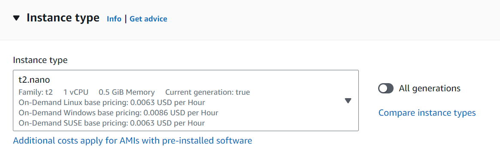
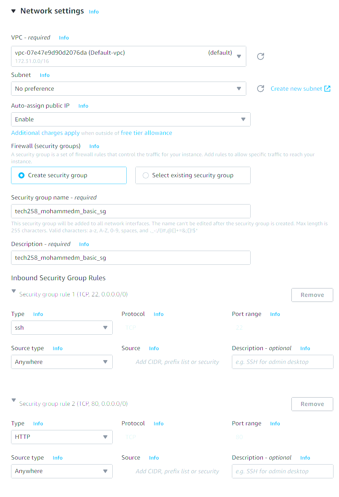
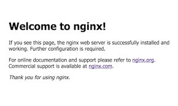

## Setting up AWS

### What is EC2?
EC2 = Elastic Compute Cloud

### What are virtual machines?
Virtual machines --> Virtualisation = creating mini machines within our machines for AWS

## How to set up AWS Server?
- Click launch instance
- Name your web server
- Choose AMI
- Choose instance type
- Configure security group and network settings
- Check out "Commands" to continue your setup

## Machine Images

An AMI is a template that contains the software configuration (operating system, application server, and applications) required to launch your instance.

## Security Groups
Security groups are essential components for controlling traffic to and from instances. Security groups allow precise control and ensure to enforce access policies. They help protect from unauthorised access, data breaches and other potential security risks within a cloud based environment.

## What are ports?
An entry point to your system, HTTP uses port 80.  
Ports are like rooms in a mansion, there are multiple ports and you need to specify which port you want to access.  
You can port forward on games to ensure you have a better connection and your NAT type is Open.

## SSH keys and how we are using them in this case
SSH keys are cryptographic keys used to authenticate and provide secure connections between a client and a server. They come in a pair, consisting of a public key and a private key. The public key is like the padlock and the private key is used to unlock the padlock. The private key must NEVER be shared.
 
We are using SSH keys to verify our instances thus ensuring our connection is secure.

## Any commands we need to run. for example
- `cd ~/.ssh` to CD into ssh folder for the SSH key
- `chmod 40 "name_of_security_key.pem"` The `chmod` command is changing the permissions of files and directories. The `40` key ensures the owner of the file can only read the file, whereas all other users have no permissions access. 
- `ssh -i "name_of_security_key.pem" ubuntu@servercode` The `-i` command is used to specify the private key that will be used for public key authentication, when connecting to the server.
- `sudo apt update -y` The `sudo` command allows you to execute commands with admin privileges. The `apt` command is a package management command tool used to interact with the Advanced Package Tool (APT) package management system. `Update` ensures to update to the latest packages, whilst `-y` automatically answers "yes" to any prompts that may be displayed.
- `sudo apt upgrade-y` This command is functionally the same as the above, aside from `upgrade` being much more dangerous to `update`. Please read the differences in the following section.
- `sudo apt install nginx -y` Here, we are installing the Nginx web server package without asking for confirmation, subsequently making it suitable for automated or unattended installation tasks.
- `systemctl status nginx` The `systemctl status nginx` command allows you to verify if your software is running.

## What do `sudo apt update` and `sudo apt upgrade doing? Why do we run them?

Update = do we have the latest packages on record?  
Upgrade = put the latest versions in to effect.

Separated for safety, very easy for conflict to happen. Update for safety, upgrade could break everything, MUST be careful.

## Why do we add `-y` to these commands usually?
`-y` is commonly used within updates, upgrades and installations as it automates the update without requiring user interaction.
## What are we installing (what is nginx?)
Nginx is a versatile and high-performance web server and proxy server that is widely used by web developers, system administrators, and organizations to deliver fast, reliable, and secure web applications and services.

## How do we check the software we installed is running?
The `systemctl status nginx` command allows you to verify if your software is running.

## Finishing up
Once you have completed the steps, you can navigate to "Instances", find the IP address linked to your instance and enter it into a new tab. You should be directed to the instance you have created. 

