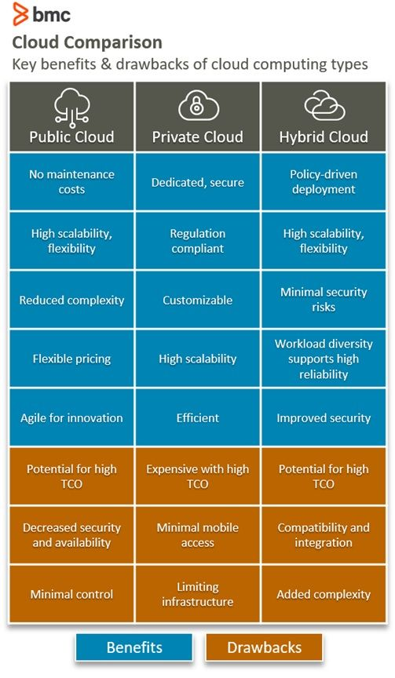
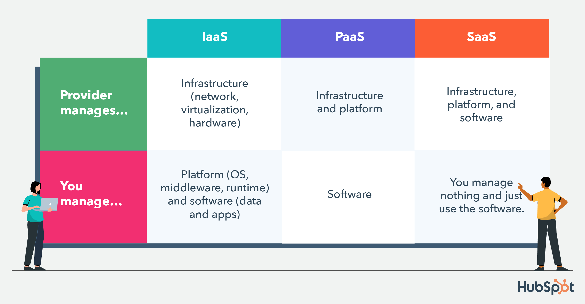
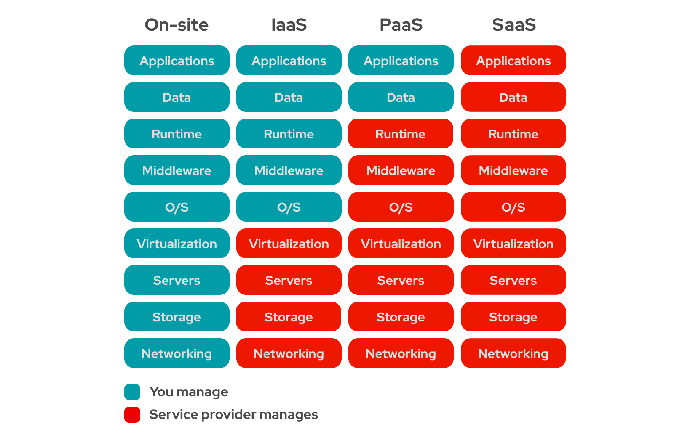

# The Cloud
## What is cloud computing? 
Cloud computing is the process of using computers or computing resources (such as servers) over the internet, as opposed to locally.
## How do we know if something is in the cloud? Differences between on-prem and the cloud?
You can determine whether something is on-prem or in the cloud through how you access it. For example, if a server is accessed through the server room in a company building, then it is on-prem. Companies have began to host servers on the cloud as this runs cheaper, hence more beneficial for the Business. This would be an instance of cloud storage.
 
'On-prem' aka on premise is when software is installed and runs on a company's own hardware infrastructure, whilst hosted locally.
 
Cloud software is stored on the provider's servers and accessed through other means, such as a web browser.
## The 4 deployment models of cloud: private vs public vs hybrid vs multi-cloud - Differences? How do they work?

- Private cloud:
  - Owned and operated by a single organisation.
  - Only internal users or authorised external users can access resources.
  - High security.
- Public cloud:
  - Owned and operated by third-party providers.
  - Accessible to anyone with an internet connection.
  - Low security.
- Hybrid cloud:
  - Combines private and public environments.
  - Interopability and flexibility allow efficiency and versatility.
  - Differing range of security based on what data is being accessed.
- Multi-cloud:
  - Multiple public cloud providers used to host different services.
  - Helps organisations reduce risks with service outages.
  - Adopted by organisations looking to maximise cloud services from multiple providers.
## Types of cloud services: IaaS, PaaS, SaaS - What are differences?

- Iaas = Infrastructure as a Service:
  - Provides computing resources over the internet, allowing users to rent components such as storage and virtual machines.
- PaaS = Platform as a Service:
  - Provides a development and deployment environment in the cloud, including tools to build, deploy and manage applications.
- SaaS = Software as a Service:
  - Provides software applications over the internet, allowing users to use services without having to manage it.

## What are the advantages/disadvantages of the cloud? (Particularly for a business)
## Difference between OpEx vs CapEx and how it relates the cloud
## Is migrating to the cloud always cheaper?
## Marketshare - What is the breakdown? Add a diagram to help understand marketshare trends
## What are the 3 largest Cloud providers known for (What makes them popular? What are some of their USPs?)
## Which cloud provider do you think might be the best? Why?
## What sorts of things do you usually need to pay for when using the cloud?
## What are the 4 pillars of DevOps? How do they link into the Cloud?