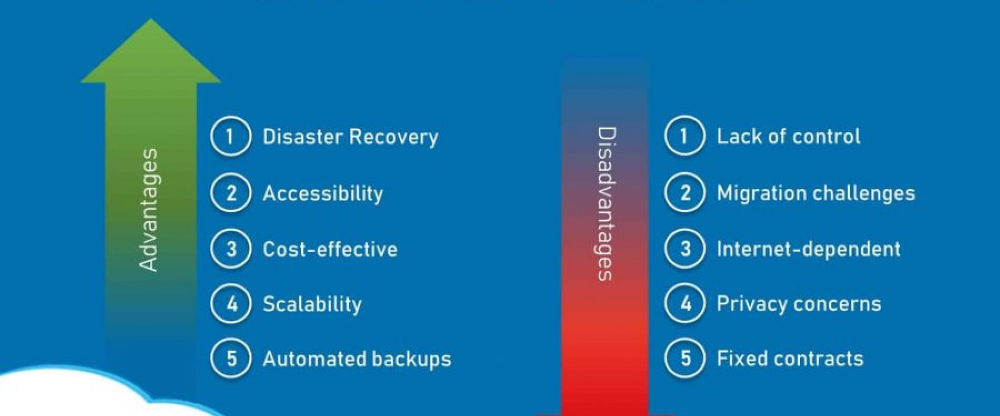
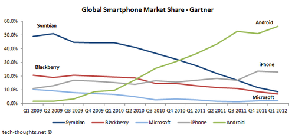

# The Cloud
## What is cloud computing? 
Cloud computing is the process of using computers or computing resources (such as servers) over the internet, as opposed to locally.
## How do we know if something is in the cloud? Differences between on-prem and the cloud?
You can determine whether something is on-prem or in the cloud through how you access it. For example, if a server is accessed through the server room in a company building, then it is on-prem. Companies have began to host servers on the cloud as this runs cheaper, hence more beneficial for the Business. This would be an instance of cloud storage.
 
'On-prem' aka on premise is when software is installed and runs on a company's own hardware infrastructure, whilst hosted locally.
 
Cloud software is stored on the provider's servers and accessed through other means, such as a web browser.
## The 4 deployment models of cloud: private vs public vs hybrid vs multi-cloud - Differences? How do they work?

- Private cloud:
  - Owned and operated by a single organisation.
  - Only internal users or authorised external users can access resources.
  - High security.
- Public cloud:
  - Owned and operated by third-party providers.
  - Accessible to anyone with an internet connection.
  - Low security.
- Hybrid cloud:
  - Combines private and public environments.
  - Interopability and flexibility allow efficiency and versatility.
  - Differing range of security based on what data is being accessed.
- Multi-cloud:
  - Multiple public cloud providers used to host different services.
  - Helps organisations reduce risks with service outages.
  - Adopted by organisations looking to maximise cloud services from multiple providers.
## Types of cloud services: IaaS, PaaS, SaaS - What are differences?

- Iaas = Infrastructure as a Service:
  - Provides computing resources over the internet, allowing users to rent components such as storage and virtual machines.
- PaaS = Platform as a Service:
  - Provides a development and deployment environment in the cloud, including tools to build, deploy and manage applications.
- SaaS = Software as a Service:
  - Provides software applications over the internet, allowing users to use services without having to manage it.

## What are the advantages/disadvantages of the cloud? (Particularly for a business)

Advantages of the cloud:
- Low cost
- Accessibility
- Scalability
- Disaster recovery

Disadvantages of the cloud:
- Security concerns
- Downtime potential
- Data privacy and compliance
- Limited control

## Difference between OpEx vs CapEx and how it relates the cloud
OpEx = Operating Expenses
 
CapEx = Capital Expenses
 
 
OpEx are the day-to-day expenses a business incurs due to the ongoing operations.
 
 
CapEx are investments in assets that provide benefits over multiple accounting periods.
   
This relates to the cloud as cloud services are primarily OpEx. However, if a business decides to build their own private cloud infrastructure, this would be a CapEx investment.
## Is migrating to the cloud always cheaper?
Migrating to the cloud is not always cheaper, as it depends on the business.
 
For example, a legacy system may incur significant costs when migrating to the cloud, hence it would be more cost-efficient to remain local. 
## Marketshare - What is the breakdown? Add a diagram to help understand marketshare trends

Market share is the percent of total sales in an industry, that is generated by a particular company.
## What are the 3 largest Cloud providers known for (What makes them popular? What are some of their USPs?)
AWS, Azure and GCP are the 3 largest Cloud providers. They account for 66% of the worldwide cloud infrastructure market.
   
They benefitted from early investment, as AWS launched its services in 2006. Azure and GCP followed shortly, hence leading to the dominant market share.  
The global reach of the 3 allow them to deploy applications close to users, thus reducing latency and increasing efficiency.
## Which cloud provider do you think might be the best? Why?
I believe AWS is the best cloud provider due to the ability for configurability that AWS provides. The AWS APIs are also superior, hence the reason for why I believe AWS is the best cloud provider.
## What sorts of things do you usually need to pay for when using the cloud?
The costs of cloud computing are:
- Networking costs
- Storage costs
- Computing costs
## What are the 4 pillars of DevOps? How do they link into the Cloud?
The four pillars of DevOps are:
- Communication
- Collaboration
- Automation
- Monitoring
   
The 4 pillars of DevOps link into the cloud as the synergy allows developers to focus on development and testing, whilst being unburdened by infrastructure concerns. 